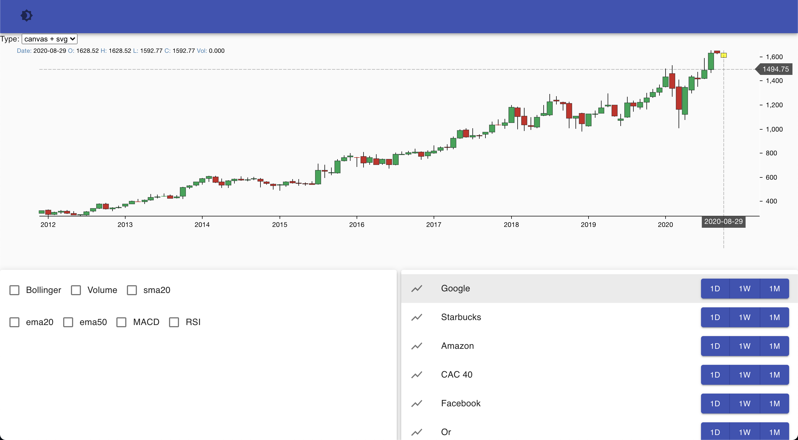
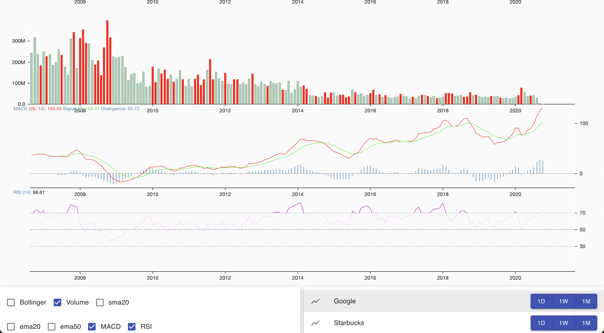
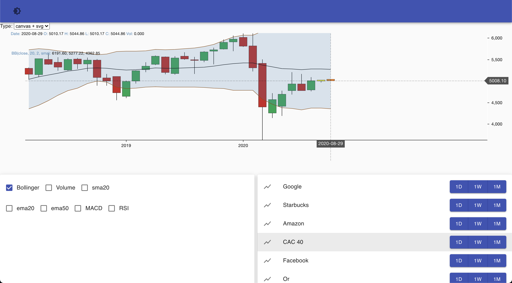

# Infinalys2

Infinalys2 is the successor of the [Infinalys project](https://github.com/PoCFrance/Infinalys) which was an IA model to predict the evolution of stock markets.



## Installation

### In the `predictor` folder, install the python modules:
```bash
pip install --user yfinance pandas stockstats tensorflow matplotlib
```

### To launch docker-compose:
On the root of project:
```bash
docker-compose up -d --build
```
(also works on podman with [podman_compose](https://github.com/containers/podman-compose) script)
  

### To stop docker-compose
```bash
dokcer-compose stop
```
By default, when you launch the docker-composes the site will be accessible on the [http://localhost:3000/](http://localhost:3000/)

## Overview

In the `src` folder, run `main.py`:
```bash
./main.py <stock> <interval>
# or
python3 main.py <stock> <interval>
```

**stock**: stock symbol to be downloaded  
**interval**: interval of the stock to be downloaded (1d, 5d, 1wk, 1mo, 3mo)

### Examples
```
./main.py APPL 1d
./main.py OIL 5d
./main.py AMZN 1mo
```

### Customisation

In the `companies.csv` you got a list of the Best 506 companies in the trading market.  
You can copy in this file somme companies and put them into the file `companies_test` to evaluate them.  
The result of the fetch of `companies_test` is put into the `stock` file

### Demonstration




## Built with

* [yahoo-finance-api](https://github.com/topics/yahoo-finance-api) - Fetch framework used
* [stock-stats](https://github.com/jealous/stockstats) - Stocks indicators calculator
* [stockCharts](https://github.com/rrag/react-stockcharts) - chart lib in react
* [materialUI](https://material-ui.com/) - graphical framework in react


## Authors

 - [Alexandre Chetrit](https://github.com/chetrit)
 - [Coline Seguret](https://github.com/Cleopha)
 - [Grégoire Brasseur](https://github.com/lerimeur)
