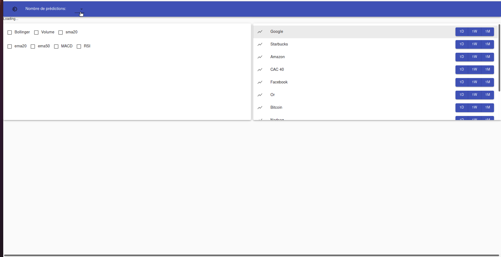

# Infinalys2

## What is Infinalys2

Infinalys2 is a [PoC](https://github.com/PoCFrance) project and the successor of the [Infinalys project](https://github.com/PoCFrance/Infinalys).  

It's a Web App that displays the history of the stock markets (curve since launch, with stock market indicators, volume, and time intervals), and their predictions (under one or more days / weeks / months), thanks to the backend, which itself draws its predictions from artificial intelligence in deep learning by taking into account the stock market indicators and history.


## How to use it ?

1. Need to have `Docker` installed
2. Clone our repository
3. Go to the `project` folder
4. Execute the following command `docker-compose up -d --build`  (also works on podman with [podman_compose](https://github.com/containers/podman-compose) script)
5. Now the docker images are created on your computer, all you have to do is go to your web browser and access the [http://localhost:3000/](http://localhost:3000/).

### Command to Initialization
```bash
git clone https://github.com/PoCFrance/Infinalys2
cd Infinalys2
docker-compose up -d --build
```

### To launch docker-compose
Once the initialization is done no more need to build it will be enough to :
```bash
docker-compose up -d
```

### To stop docker-compose
```bash
docker-compose stop
```

## Customisation

In the `companies.csv` you got a list of the Best 506 companies in the trading market.  
You can copy in this file somme companies and put them into the file `companies_test` to evaluate them.  
The result of the fetch of `companies_test` is put into the `stock` file

## Demonstration



## Built with

* [yahoo-finance-api](https://github.com/topics/yahoo-finance-api) - Fetch framework used
* [stock-stats](https://github.com/jealous/stockstats) - Stocks indicators calculator
* [stockCharts](https://github.com/rrag/react-stockcharts) - chart lib in react
* [materialUI](https://material-ui.com/) - graphical framework in react


## Authors

 - [Alexandre Chetrit](https://github.com/chetrit)
 - [Coline Seguret](https://github.com/Cleopha)
 - [Grégoire Brasseur](https://github.com/lerimeur)
