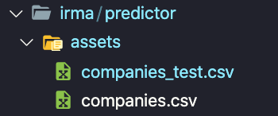

# Infinalys2
# Infinalys2

Infinalys2 is the successor of the Infinalys project which was an artificial intelligence to make prediction of the trading market and currently on the project you have the recovery of trading information.

## Getting Started

### Prerequisites

## you must install python before going on
```
pip install yfinance --user
pip install pandas --user
pip install stockstats --user
pip install tensorflow --user
pip install matplotlib --user
```

## Overview

Move into src Folder and run main.py
```
./main.py 

OR

python3 main.py
```
### Customisation

In the folder assets in irma folder you can see 2 file 



In the companies.csv you got a list of the Best 506 companies in the trading market.

And you can copy in this file somme companies and put them into the file companies_test to evaluate them

the result of the fetch of companies_test is put into the ```stock ``` file 

## Built With

* [yahoo-finance-api](https://github.com/topics/yahoo-finance-api) - Fetch framework used
* [stock-stats](https://github.com/jealous/stockstats) - Stocks indicators calculator
